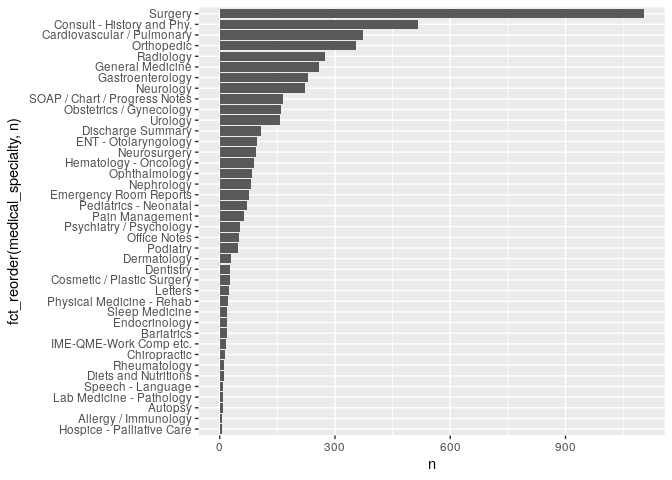
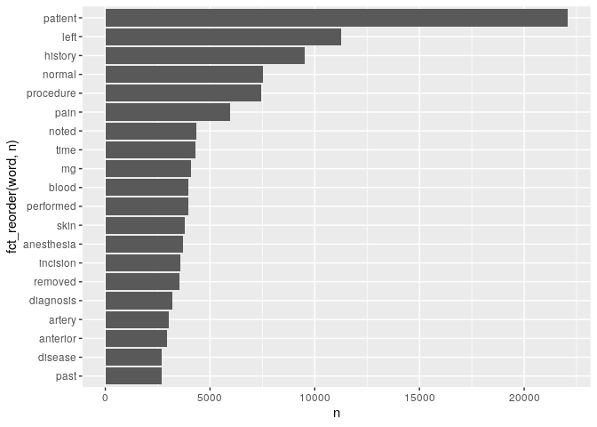

Lab 6
================

## Download the data

``` r
fn <- "mtsamples.csv"
if (!file.exists(fn))
  download.file("https://raw.githubusercontent.com/USCbiostats/data-science-data/master/00_mtsamples/mtsamples.csv", destfile = fn)

mtsamples <- read.csv(fn)
mtsamples <- as_tibble(mtsamples)
```

## Q1: How many and how are specialties distributed?

``` r
specialties <- mtsamples %>%
  count(medical_specialty)

specialties %>%
  arrange(desc(n)) %>%
  top_n(15) %>%
  knitr::kable()
```

    ## Selecting by n

| medical\_specialty            |    n |
|:------------------------------|-----:|
| Surgery                       | 1103 |
| Consult - History and Phy.    |  516 |
| Cardiovascular / Pulmonary    |  372 |
| Orthopedic                    |  355 |
| Radiology                     |  273 |
| General Medicine              |  259 |
| Gastroenterology              |  230 |
| Neurology                     |  223 |
| SOAP / Chart / Progress Notes |  166 |
| Obstetrics / Gynecology       |  160 |
| Urology                       |  158 |
| Discharge Summary             |  108 |
| ENT - Otolaryngology          |   98 |
| Neurosurgery                  |   94 |
| Hematology - Oncology         |   90 |

There are 40 specialties. Let’s take a look at the distribution:

``` r
# Method 1 (not that pretty)
ggplot(mtsamples, aes(x = medical_specialty)) +
  geom_histogram(stat = "count") +
  coord_flip()
```

    ## Warning: Ignoring unknown parameters: binwidth, bins, pad

<!-- -->

``` r
# Method 2
ggplot(specialties, aes(x = n, y = fct_reorder(medical_specialty, n))) +
  geom_col()
```

<!-- -->

These are not evenly (uniformly) distributed.

## Question 2

``` r
mtsamples %>%
  unnest_tokens(output = word, input = transcription) %>%
  count(word, sort = TRUE) %>%
  top_n(20) %>%
  ggplot(aes(x = n, y = fct_reorder(word, n))) +
    geom_col()
```

    ## Selecting by n

<!-- -->

The word “patient” seems to be importat (duh!), but we observe a lot of
stopwords.

## Question 3

``` r
mtsamples %>%
  unnest_tokens(output = word, input = transcription) %>%
  count(word, sort = TRUE) %>%
  anti_join(stop_words, by = "word") %>%
  # Using regular expressions to remove numbers
  filter(!grepl(pattern = "^[0-9]+$", x = word)) %>%
  top_n(20) %>%
  ggplot(aes(x = n, y = fct_reorder(word, n))) +
    geom_col()
```

    ## Selecting by n

<!-- -->

Looking better~~, but we don’t like the numbers~~.

## Question 4

``` r
mtsamples %>%
  unnest_ngrams(output = bigram, input = transcription, n = 2) %>%
  count(bigram, sort = TRUE) %>%
  top_n(20) %>%
  ggplot(aes(x = n, y = fct_reorder(bigram, n))) +
    geom_col()
```

    ## Selecting by n

<!-- -->

Using bi-grams is not very informative, let’s try with tri-grams
instead.

``` r
mtsamples %>%
  unnest_ngrams(output = trigram, input = transcription, n = 3) %>%
  count(trigram, sort = TRUE) %>%
  top_n(20) %>%
  ggplot(aes(x = n, y = fct_reorder(trigram, n))) +
    geom_col()
```

    ## Selecting by n

<!-- -->

Now some phrases start to show up, e.g., “tolerated the procedure”,
“prepped and draped.”
